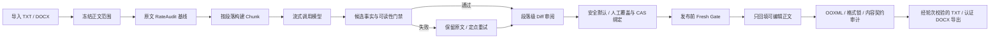

<div align="center">
  
  <h1>论文 AI 降检平台 FYADR</h1>
  <p><strong>面向中国大学生毕业论文的中文论文 AI 痕迹优化、分轮审阅与 Word 原格式保真工具</strong></p>
  <p>
    本地优先 · OpenAI-compatible · 流式长任务 · 可解释质量门禁 · 人工 Diff 审阅 · DOCX 只改正文
  </p>

  <p>
    <a href="https://github.com/multi-zhangyang/fuck-your-ai-detection-rate/actions/workflows/ci.yml"></a>
    <a href="https://github.com/multi-zhangyang/fuck-your-ai-detection-rate/blob/main/LICENSE"></a>
    <a href="https://github.com/multi-zhangyang/fuck-your-ai-detection-rate"></a>
    <a href="https://github.com/multi-zhangyang/fuck-your-ai-detection-rate/commits/main/"></a>
  </p>
  <p>
    <a href="https://www.python.org/"></a>
    <a href="https://nodejs.org/"></a>
    <a href="https://react.dev/"></a>
    <a href="https://vite.dev/"></a>
    <a href="https://docs.docker.com/compose/"></a>
    
    
  </p>
</div>

---

FYADR 是一个可本地运行的 **论文 AI 降检平台**。它面向“毕业论文怎么降 AI 率”“中文论文如何降低 AIGC 生成痕迹”“Word 论文怎样保持格式不变只改正文”等真实需求，把模型改写、候选质量检查、人工确认和 DOCX 格式保真连接成一条可审计工作流。

项目不会简单地把原论文“换一种模板重写”。它更关心三件事：改写是否真的比原文自然，事实与术语是否仍然准确，以及标题、目录、公式、表格、参考文献等 Word 结构是否完全留在模型之外。

> [!IMPORTANT]
> FYADR **不是 AIGC 检测器**，风险点数也不是“AI 率”。项目不隶属于知网、维普、万方、Turnitin、GPTZero 或其他检测平台，不承诺通过任何学校、期刊或第三方系统。请遵守学校与机构的学术诚信规范，并对最终论文逐段人工复核。

## 快速导航

- [产品截图](#产品截图)
- [核心能力](#核心能力)
- [完整工作流](#完整工作流)
- [降 AI 痕迹质量链](#降-ai-痕迹质量链)
- [DOCX 只改正文与格式保真](#docx-只改正文与格式保真)
- [快速开始](#快速开始)
- [模型与提示词配置](#模型与提示词配置)
- [开发、测试与 CI](#开发测试与-ci)
- [常见问题](#常见问题)
- [安全、隐私与学术诚信](#安全隐私与学术诚信)

## 为什么选择 FYADR

| 普通“论文改写器”常见问题 | FYADR 的处理方式 |
| --- | --- |
| 只追求同义替换，改完可读性明显下降 | 使用相对原文的学术语域、句法节奏、模板表达和文档级 delta 门禁 |
| 模型擅自添加“仅、全部、必然”等限定词 | 事实范围限定词门禁检测新增、删除与类别变化，发布前重新验证 |
| 长思考模型容易超时 | 默认支持流式接收、长超时、重试、checkpoint 与断点续跑 |
| 模型思考内容混入正文 | reasoning / thinking 与正文分离，失败证据不保存思考文本和原始错误正文 |
| Word 改写后目录、标题或格式乱掉 | 先冻结正文 body map，只向模型发送可编辑正文，再执行 OOXML 与格式锁审计 |
| 自动选一个候选直接覆盖原稿 | 普通块使用可解释的安全默认，需复核候选必须显式确认；发布文本仍受 hash、revision 与 fresh gate 约束 |
| 用一个“AI 分数”制造确定性 | RateAudit 只展示可解释的同文档相对风险，不冒充第三方检测概率 |

## 产品截图

以下界面均由真实生产前端和可复现的 synthetic fixture 生成，不包含真实论文、API Key、个人路径或用户历史。

<table>
  <tr>
    <td width="50%" valign="top">
      <a href="./docs/assets/readme/01-workbench.webp"></a>
      <br /><strong>工作台与段落级 Diff</strong><br />
      <sub>在一个页面中完成文档导入、分轮运行、质量状态、人工审阅与 Word 导出。</sub>
    </td>
    <td width="50%" valign="top">
      <a href="./docs/assets/readme/02-quality-audit.webp"></a>
      <br /><strong>可解释降检报告</strong><br />
      <sub>比较原文与当前轮的相对风险变化，定位问题热区，并同时检查正文与格式契约。</sub>
    </td>
  </tr>
  <tr>
    <td width="50%" valign="top">
      <a href="./docs/assets/readme/03-docx-protection.webp"></a>
      <br /><strong>DOCX 保护区地图</strong><br />
      <sub>直观看到哪些正文可以进入模型，以及标题、目录、题注、公式、表格和参考文献为何被冻结。</sub>
    </td>
    <td width="50%" valign="top">
      <a href="./docs/assets/readme/04-model-routing.webp"></a>
      <br /><strong>模型路由与流式安全</strong><br />
      <sub>管理多个 OpenAI-compatible 服务商，为不同轮次指定模型，并控制流式、超时、重试和并发。</sub>
    </td>
  </tr>
  <tr>
    <td colspan="2" valign="top">
      <a href="./docs/assets/readme/05-history.webp"></a>
      <br /><strong>历史、恢复与资产治理</strong><br />
      <sub>恢复文档与轮次、继续 checkpoint、查看导出资产，并维护本地 SQLite 历史索引。</sub>
    </td>
  </tr>
</table>

## 适用场景

FYADR 适合下面这些实际工作场景：

- 中国大学生本科毕业论文降 AI 率、硕士论文降低 AI 生成痕迹。
- 中文论文 AIGC 检测率优化、论文 AI 痕迹自然化与学术语气修整。
- Word 论文固定格式、只改正文，不改标题、目录、公式、表格和参考文献。
- 使用长思考模型、自建中转站或 OpenAI-compatible API 处理长篇论文。
- 对模型改写结果做逐段 Diff、事实核对、引用保护和人工确认。
- 在 Windows、macOS、Linux 工作站或可信 VPS 上进行本地部署。

它也可以用于课程论文、技术报告和结构复杂的学术 DOCX，但当前主要针对中文论文工作流设计。

## 核心能力

### 论文 AI 痕迹优化

- `RateAudit`：对同一篇论文的原文和各轮结果做离线相对诊断，不调用模型、不消耗 Token。
- `Source-relative delta`：判断候选是否相对原文新引入机械连接、套话、碎句、同构句式或语域漂移。
- `Academic readability`：检查可读性、句法完整性、学术语气和段落衔接，避免“为了降 AI 而胡言乱语”。
- `Dimension rotation`：按风险维度选择下一步，不在同一种改写模式里无限重复。
- `Targeted rerun`：只重跑真正需要处理的段落，保留已经通过审核的内容。

### 事实与正文安全

- 保护引用标记，如 `[1]`、`[3-5]`。
- 保护数字、比例、单位、术语、协议名和结构编号。
- 检查事实关系与主体、客体、否定、比较和范围限定词变化。
- 阻止无依据新增“仅、只、唯一、全部、所有、必然、always、only”等表达。
- 校验失败时保留原文或进入明确的失败状态，不把危险候选静默发布。
- 发布阶段执行 fresh revalidation，旧证据不能绕过当前门禁。

### 长任务与思考模型

- Chat Completions 与 Responses 风格的 OpenAI-compatible 接口。
- 默认流式接收，降低代理、网关和长思考模型的超时风险。
- reasoning / thinking 内容与最终正文分离。
- 默认超时 `600` 秒，可配置到 `3600` 秒。
- 指数退避、随机抖动与可配置重试。
- chunk 并发执行，按原文顺序恢复结果。
- checkpoint、取消、刷新后重新连接与断点续跑。

### Word 原格式保真

- 识别并冻结可编辑正文范围。
- 标题、目录、题注、公式、表格、参考文献、页眉页脚、声明和模板说明不进入模型。
- 对 bookmark、comment range、field、drawing、math、numbering 和复杂 inline 结构执行保护。
- 只回填冻结 body map 中的正文文字目标。
- 导出前后检查正文契约、保护区、OOXML、样式、编号、节属性和格式签名。
- 导出证据绑定 source、snapshot、review、compare、artifact hash 与 revision。

### 产品工作台

- 克制的 Vercel 风格深浅色 UI。
- 多服务商、模型目录和分轮模型路由。
- 提示词 CRUD、自定义工作流与内置模板恢复。
- 段落级 Diff、筛选、定位、人工决定和冲突提示。
- 导出健康面板与阻断原因展示。
- SQLite 历史索引、备份、压缩、修复和孤儿资产扫描。
- 桌面与移动端响应式布局。

## 完整工作流



这条链路由两个互相独立、必须同时通过的契约控制：

| 契约 | 解决的问题 | 关键证据 |
| --- | --- | --- |
| 降检质量契约 | 改写是否比原文更自然，是否损害事实与可读性 | 候选选择、source-relative delta、事实门禁、安全默认、显式人工决定与 fresh gate |
| 正文与格式契约 | 是否只改允许的正文，是否破坏 Word 结构和版式 | snapshot、body map、scope digest、format digest、OOXML audit |

任意一个契约失败，系统都不会把结果标记为可安全导出。

## 降 AI 痕迹质量链

### 1. RateAudit：不是 AI 检测器的可解释诊断

RateAudit 对同一篇文档的原文与当前结果进行相对比较，覆盖：

- 句式与节奏：连续等长句、句模集中、短碎句投机。
- 衔接脚手架：连接词密度与成组机械推进。
- 模板表达：套话、泛化总结、空泛填充和公式化短语。
- 段落结构：段长过度整齐、嵌套编号、冒号—分号模板。
- 语态与语域：连续同构被动表达、学术语气漂移。

报告给出风险点轨迹、维度变化、问题段落热区和下一步建议，并在“停止自动处理”“定点重跑”“进入下一维度”“转人工复核”之间做明确决策。

风险点是启发式信号，只适合比较同一篇文档的前后变化，不能换算成第三方 AIGC 检测率或通过概率。算法说明见 [RateAudit 设计文档](docs/RATE_AUDIT_DESIGN.md)。

### 2. 候选不是越“像人”越好

FYADR 不会为了改变统计分布强造短句、被动句、长定语或删除必要连接词。每个候选需要同时满足：

1. 结构、编号、引用、数字、术语和语言一致性硬检查。
2. 事实主体、关系、否定、比较和范围限定词检查。
3. 相对原文的学术可读性与语域 delta 检查。
4. 文档级重复模式与句法节奏检查。
5. 候选选择证据与最终发布文本 hash 一致。

如果候选只是“换了另一套 AI 模板”，系统可以保留原文，而不是为了制造改写数量强行采用。

### 3. 可见审阅与强制确认

Diff 区会展示每块的安全默认、风险原因和人工覆盖入口：

- `采用改写`：普通候选通过门禁后可以作为安全默认，用户仍可逐段改为保留原文。
- `保留原文`：候选没有可靠收益、触发风险回退，或用户明确选择原文。
- `需处理`：定点策略或高风险块需要人工核对；要求确认的候选在确认前仍按原文导出。
- `失败`：硬门禁、供应商调用或证据绑定失败。

显式人工决定与 compare revision 和候选 hash 绑定，多标签页同时保存时使用 CAS 防止旧页面覆盖新决定。没有人工覆盖的普通块会在发布时重新计算确定性的安全默认，并与候选证据一起经过 fresh revalidation；系统不会把“默认采用”包装成“人工已确认”。

## DOCX 只改正文与格式保真

### 可编辑与保护范围

| Word 内容 | 默认处理策略 |
| --- | --- |
| 普通正文段落 | 经结构识别和格式锚点检查后可进入模型 |
| 自动编号正文 | 正文可改，编号标记与编号定义受保护 |
| 中文/英文摘要正文 | 在边界与结构证据充分时可编辑 |
| 标题与章节标题 | 保护，不进入模型 |
| 自动目录与目录项 | 保护，不进入模型 |
| 表格、表题、表注 | 保护，不进入模型 |
| 图片、图题、图注 | 保护，不进入模型 |
| 公式与数学对象 | 保护，不进入模型 |
| 参考文献 | 保护，不进入模型 |
| 页眉、页脚、页码、域 | 保护，不进入模型 |
| 声明、附录和后置材料 | 保护，不进入模型 |
| 模板撰写指导语 | 标记为 `template_instruction`，保护且不进入比较正文 |
| Bookmark / Comment range anchor | 保护；只有无锚点且满足正文合同的内部正文才能编辑 |

### 四个时间点的检查

1. **导入时**：建立 DOCX snapshot、结构角色、语义范围与格式库存。
2. **每轮开始时**：确认模型输入逐单元等于冻结可编辑正文。
3. **导出前**：确认 review materialization、body map、source generation 和目标数量一致。
4. **导出后**：重新审计保护区文字、OOXML 拓扑、样式、编号、表格、节属性与格式锁。

> [!NOTE]
> “原格式保真”指正文以外的结构和可见格式受到契约与审计保护，不代表整个 ZIP 包逐字节完全相同。Word 在重新序列化时可能调整包内元数据或 XML 字节排列；FYADR 检查的是内容边界、OOXML 结构、样式与格式语义是否保持。

FYADR 不提供学校格式说明解析、套版或“学校规范对照”页面。对于原 DOCX，格式唯一真相源就是上传文件本身：产品固定使用 `preserve_original`，只替换冻结正文目标的文字，不依据外部规则改字体、字号、行距、页边距或重排原 Word。技术设计见 [双契约设计文档](docs/DUAL_CONTRACT_DESIGN.md)。

## 快速开始

### Windows、macOS、Linux 支持状态

| 平台 | 原生启动 | Docker | CI 安装与启动 Smoke |
| --- | --- | --- | --- |
| Windows 10 / 11 | `start_web.ps1` / `start_web.bat` | Docker Desktop | `windows-latest` |
| macOS | `./start_web.sh` | Docker Desktop / OrbStack | `macos-latest` |
| Linux | `./start_web.sh` | Docker Engine + Compose | `ubuntu-latest` |

三平台应用级 smoke 都会在干净 runner 中安装 Python 与 npm 依赖、构建前端、启动随机本机端口的服务并加载 production build，再验证 `/api/ping`、`/api/health`、首页和静态资源。启动器本身另做 PowerShell 或 Bash 语法与帮助入口检查；这些验证不依赖本地论文、API Key、浏览器或真实模型。

### 方式一：Docker Compose（推荐用于 Linux / VPS 本机运行）

```bash
git clone https://github.com/multi-zhangyang/fuck-your-ai-detection-rate.git
cd fuck-your-ai-detection-rate
docker compose up -d --build
```

打开：

```text
http://127.0.0.1:8765
```

健康检查：

```bash
curl http://127.0.0.1:8765/api/ping
```

默认 Compose 约束：

- 只发布 `127.0.0.1:8765`，不直接开放公网。
- 1 CPU、2 GiB 内存、256 PIDs。
- 1 个 Gunicorn worker、4 个 threads。
- `json-file` 日志单文件 10 MiB，最多 3 个。
- `origin / finish / config / prompts-custom` 使用持久化 bind mounts。

完整部署和升级说明见 [DEPLOY.md](DEPLOY.md)。

### 方式二：Windows 一键启动

环境要求：

- Windows 10 / 11
- Python 3.10+
- Node.js `20.19+` 或 `22.12+`
- npm

首次启动或需要重新安装项目依赖：

```powershell
.\start_web.bat -Install
```

启动：

```powershell
.\start_web.bat
```

批处理入口会临时使用 `ExecutionPolicy Bypass` 调用项目脚本，不会永久修改系统执行策略。执行策略允许时，也可以直接运行：

```powershell
.\start_web.ps1
```

不自动打开浏览器：

```powershell
.\start_web.bat -NoBrowser
```

开发模式默认地址：

- 前端：`http://127.0.0.1:1420`
- 后端：`http://127.0.0.1:8765`
- 健康检查：`http://127.0.0.1:8765/api/health`

### 方式三：macOS / Linux 一键启动

首次启动或需要自动补齐依赖：

```bash
./start_web.sh --install
```

已经安装依赖时：

```bash
./start_web.sh
```

不自动打开浏览器：

```bash
./start_web.sh --no-browser
```

脚本不会为了抢占端口而终止未知进程：如果发现已健康的 FYADR 后端会安全复用；如果端口被其他服务占用则明确失败。脚本退出时只清理由它自己启动的前后端进程。

### 方式四：手动启动

后端：

```bash
python scripts/web_app.py
```

前端：

```bash
npm --prefix app run dev:web
```

## 基本使用流程

1. 在“模型配置”中填写 OpenAI-compatible Base URL、API Key 和模型名。
2. 打开流式响应，根据供应商能力设置超时、重试和并发。
3. 上传 TXT 或 DOCX；DOCX 会先生成正文边界与保护区证据。
4. 在“降检报告”查看原文基线、风险维度与问题热区。
5. 选择提示词流程和分轮模型路由，启动第一轮。
6. 长任务可以取消、刷新页面或在异常后从 checkpoint 继续。
7. 在 Diff 中逐段查看原文、候选、质量原因和审核绑定。
8. 复核系统的采用或保留默认；按需显式覆盖，定点策略与需复核候选必须人工确认。
9. 查看新的 RateAudit delta，决定停止、下一维度或继续人工处理。
10. 导出前确认正文与格式双契约均为 ready。
11. 导出 TXT 或认证 DOCX，并保留本地证据与历史记录。

## 模型与提示词配置

### 模型配置

主要字段：

| 字段 | 说明 |
| --- | --- |
| `baseUrl` | OpenAI-compatible API 根地址 |
| `apiKey` | 本机保存的模型密钥 |
| `model` | 默认模型名 |
| `apiType` | `chat_completions` 或 `responses` |
| `streaming` | 是否流式接收；长任务建议开启 |
| `temperature` | 模型温度 |
| `requestTimeoutSeconds` | 单次请求超时，默认 600 秒 |
| `maxRetries` | 传输或可恢复错误的重试次数 |
| `rewriteConcurrency` | chunk 并发，范围 1–16 |
| `modelProviders` | 多服务商配置列表 |
| `roundModels` | 不同轮次的模型路由快照 |

Web 端只接收脱敏后的已保存密钥状态，不会把完整 API Key 写入浏览器 localStorage。配置位置：

- Windows：`%APPDATA%\FYADR\config.json`
- macOS / Linux：`~/.fyadr/config.json`
- Docker：挂载到 `/app/config`

POSIX 系统会把配置目录和文件权限收紧为 `0700 / 0600`，保存使用原子替换。

### 内置提示词

| ID | UI 名称 | 目标 |
| --- | --- | --- |
| `prewrite` | 润色改写 | 保守自然化与结构预热 |
| `template-repair` | 模板表达定点修复 | 只处理模板句与空泛填充 |
| `classical` | 经典改写 | 慢节奏解释型改写 |
| `round1` | 规范改写 | 调整同构句式与不合理句界 |
| `round2` | 专家改写 | 终稿衔接、指代与同义反复校正 |

默认可见流程：

```text
润色改写 → 规范改写 → 专家改写
```

内置提示词可编辑并恢复默认，自定义提示词可以创建、改名、保存、删除和恢复备份。流程注册位于：

- `prompts/prompt-registry.json`
- `prompts/prompt-workflows.json`
- `prompts/defaults/`
- `prompts/custom/`

## 历史、恢复与本地资产

FYADR 使用 JSON 兼容记录与 SQLite 索引共同管理历史：

- 文档、轮次、模型路由和产物引用索引。
- 历史列表与当前文档恢复。
- checkpoint 和后台任务摘要恢复。
- 删除影响预览，避免误删共享资产。
- 孤儿文件扫描与安全清理。
- SQLite 健康检查、备份、压缩和恢复。

运行目录：

```text
origin/                         # 内容寻址的上传源文档
finish/intermediate/            # manifest、compare、review、body map、checkpoint
finish/web_exports/             # Web 导出副本
finish/fyadr_history.sqlite3    # SQLite 历史索引
finish/history_db_backups/      # 数据库备份
```

上传文件按完整内容 SHA-256 进入独立目录。同名但内容不同的论文不会覆盖，完全相同的内容可以安全复用。

以上运行目录均被 `.gitignore` 排除，不应提交到公开仓库。

## 技术架构

| 层 | 技术与职责 |
| --- | --- |
| Web UI | React 18、TypeScript、Vite、Tailwind CSS、Radix / shadcn 风格组件 |
| API | Flask、Gunicorn、SSE、线程安全任务注册表 |
| 模型连接 | OpenAI-compatible Chat Completions / Responses、流式解析、重试与限流 |
| 论文算法 | chunk manifest、candidate selection、RateAudit、source-relative delta、事实门禁 |
| DOCX | python-docx、OOXML snapshot、body map、保护区与格式锁审计 |
| 状态 | JSON 兼容记录、SQLite 索引、checkpoint、CAS review sidecar |
| 部署 | Windows / macOS / Linux 原生启动脚本、Docker 多阶段 production build、本机-only Compose |

项目结构：

```text
.
├─ app/                         # React / TypeScript 前端
├─ scripts/                     # Flask、论文算法、DOCX 与回归脚本
├─ prompts/                     # 提示词、默认版本与工作流注册表
├─ docs/                        # 设计、开发、发布与 README 展示资产
├─ references/                  # 发布检查与优化路线资料
├─ assets-source/               # 品牌源文件
├─ Dockerfile                   # 前端构建 + Python runtime 多阶段镜像
├─ docker-compose.yml           # 本机-only 生产部署
├─ start_web.ps1                # Windows 一键启动
├─ start_web.bat
├─ start_web.sh                 # macOS / Linux 一键启动
└─ requirements.txt
```

## 开发、测试与 CI

### 常用命令

安装：

```bash
pip install -r requirements.txt
npm --prefix app ci
```

前端文案、类型与专项回归：

```bash
npm --prefix app run check
```

前端生产构建：

```bash
npm --prefix app run build
```

完整回归：

```bash
python scripts/run_regressions.py
```

Fail-fast CI 形式：

```bash
python scripts/run_regressions.py --fail-fast
```

浏览器 smoke：

```bash
npm --prefix app run test:e2e:smoke
```

开源泄密与仓库卫生审计：

```bash
python scripts/open_source_audit.py
```

当前回归注册表覆盖 94 项基础命令；默认全量模式另追加前端 production build，共执行 95 项命令。覆盖范围包括：

- 流式输出与思考内容隔离。
- candidate-selection、事实门禁与 source-relative delta。
- review CAS、round snapshot 与发布 revision 绑定。
- RateAudit 决策与策略执行。
- DOCX snapshot、正文边界、bookmark/comment range 和格式保真。
- 历史数据库、断点恢复、Web 安全、部署约束与开源审计。
- TypeScript 类型检查、前端状态一致性和 Vite build。

GitHub Actions 包含两层检查：

- `windows-latest` 执行 Python 3.11、Node.js 24 和完整 fail-fast 回归。
- `windows-latest / macos-latest / ubuntu-latest` 三平台矩阵执行干净安装、前端 production build 和本机服务 smoke。

默认 CI 使用离线 fixture，不读取真实论文、不需要 API Key，也不会调用付费模型。

详细开发文档见 [docs/DEVELOPMENT.md](docs/DEVELOPMENT.md)，发布门禁见 [docs/RELEASE_CHECKLIST.md](docs/RELEASE_CHECKLIST.md)。

## 常见问题

### 中国大学生毕业论文怎么降低 AI 检测率？

先不要直接对全文做多轮同义替换。更稳妥的流程是：建立原文基线，定位模板化与机械句式集中的段落，只对问题块做保守改写，再逐段核对事实、引用、数字和可读性。FYADR 把这套流程实现为 RateAudit、定点重跑、Diff 审阅和发布门禁。

### FYADR 能保证降低知网、维普、万方或其他平台的论文 AI 率吗？

不能保证。不同检测平台的模型、版本和规则并不公开，而且会持续变化。FYADR 与这些平台没有隶属或合作关系，也不会伪造一个“通过率”。它提供的是可解释的文本优化与格式安全工具，最终结果必须以学校要求和用户人工审核为准。

### 这是论文 AI 降重工具吗？

FYADR 主要处理 AI 写作痕迹、模板表达、句式节奏和机械衔接，不提供查重数据库，也不计算传统文字复制率。“AI 降检”和“论文查重降重”不是同一个任务。

### 改写后会不会可读性下降或胡言乱语？

候选需要通过事实、数字、引用、术语、范围限定词、学术可读性和 source-relative delta 门禁。普通块会得到可解释的采用或保留默认，定点策略与需复核候选则必须人工明确确认；无论系统默认如何，最终提交前都应由作者逐段检查，不可靠候选可以直接保留原文。

### Word 论文格式会不会变化？

DOCX 模式先冻结可编辑正文，只回填对应正文文字，并在导出前后检查保护区、OOXML、样式、编号、表格和节属性。复杂或证据不足的结构会 fail-closed，而不是冒险写回。请仍然使用 Microsoft Word 或兼容软件打开最终文件进行人工复核。

### 标题、目录、公式、表格和参考文献会被发送给模型吗？

默认不会。这些内容被识别为保护区，不进入 body map、模型输入或改写 Diff。模板说明和致谢指导语也会作为 `template_instruction` 冻结。

### 思考模型会不会把 reasoning 写进论文？

流式解析会区分 reasoning/thinking 与最终正文。思考内容不会作为候选正文展示或回填；失败证据也不会保存原始思考文本。

### 长思考模型总是超时怎么办？

保持流式开启，把 `requestTimeoutSeconds` 调到 `600` 或更高，从并发 `2` 或 `4` 开始。若上游频繁返回 500/502/503/504，先降低并发；中断后可以利用 checkpoint 继续，已完成块不会重新调用。

### 论文会上传到项目作者的服务器吗？

不会上传到项目作者维护的服务器。FYADR 是本地优先工具，文档、配置、历史和导出保存在你的运行环境中；论文改写时，只把冻结后的可编辑正文发送到你自己配置的模型服务商。“测试连接”会发出最小测试请求。请只连接你信任的服务，并确认其数据保留政策。

### 可以直接把 8765 端口开放到公网吗？

不建议。当前 API 没有内置账号系统、多用户隔离或细粒度权限控制。Docker 默认只绑定 `127.0.0.1:8765`。远程使用应通过可信网络、SSH 隧道或具备身份认证、来源限制和限流的前置网关。

### 为什么有时系统选择保留原文？

因为“产生了不同文本”不等于“得到更好的论文”。如果候选收益不足、事实风险增加、语域漂移或证据不完整，保留原文是更安全的发布决定。

## 安全、隐私与学术诚信

- 不要把真实论文、检测报告、API Key、私有模型地址和个人路径提交到公开仓库或 Issue。
- 不要在截图中暴露论文正文、学校、姓名、学号、导师、密钥或供应商后台。
- Web 配置保存在本机，前端只显示脱敏密钥状态。
- 论文改写只发送冻结的可编辑正文；连接测试会向所选服务商发出最小测试请求。
- 模型调用记录只保留必要的结构化状态，不把 prompt、输出正文、reasoning 或原始供应商错误写进运行报告。
- 对外开放前必须自行增加认证、授权、TLS、来源限制、请求限流和审计。
- 使用模型处理未公开论文前，请确认学校规定、保密义务和模型服务商的数据条款。
- FYADR 用于辅助作者修订自己有权处理的文档，不应用于代写、伪造研究或规避学术诚信责任。

发现安全问题请阅读 [SECURITY.md](SECURITY.md)，不要在公开 Issue 中提交敏感复现材料。

## 相关主题

本项目主要对应以下中文主题：

`毕业论文降 AI 率` · `论文 AIGC 检测率优化` · `中国大学生毕业论文 AI 痕迹` · `中文论文降 AI` · `硕士论文 AI 检测` · `本科论文 AI 降检` · `Word 论文格式不变` · `DOCX 只改正文` · `本地部署论文降检工具` · `OpenAI 兼容论文改写`

这些关键词用于说明项目能力边界，不构成任何检测平台通过承诺。

## 贡献

欢迎提交 Bug、跨平台兼容性问题、脱敏最小复现和改进建议：

- [提交 Bug](https://github.com/multi-zhangyang/fuck-your-ai-detection-rate/issues/new?template=bug_report.yml)
- [提出功能建议](https://github.com/multi-zhangyang/fuck-your-ai-detection-rate/issues/new?template=feature_request.yml)
- [贡献指南](CONTRIBUTING.md)

提交 Pull Request 前请运行完整回归和开源审计。不得提交真实论文、真实检测报告或真实凭据；README 产品截图只允许使用可复现的 synthetic fixture。

## 项目来源与致谢

本项目早期基础设施和使用思路参考了 [baibaiAIGC](https://github.com/poleHansen/baibaiAIGC)。

部分中文改写提示词的设计参考了 [Linux.do](https://linux.do/) 社区的公开讨论、经验总结和用户整理内容。当前提示词已经重新组织为适配本项目双契约与人工审阅流程的版本。继续分发或二次开发时，请尊重原内容贡献者和对应平台规则。

## License

FYADR 以 [AGPL-3.0](LICENSE) 协议发布。通过网络向用户提供修改后的程序时，请遵守 AGPL-3.0 的源码开放义务。

---

<div align="center">
  <strong>先守住事实与格式，再谈论文 AI 痕迹优化。</strong>
  <br />
  <sub>If FYADR helps your workflow, consider giving the repository a Star.</sub>
</div>
