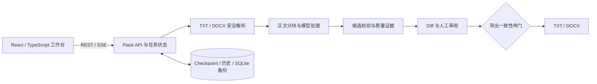

<div align="center">
  
  <h1>FYADR</h1>
  <p><strong>论文 AI 降检平台</strong></p>
  <p>文档导入 · 模型路由 · 分轮改写 · Diff 审阅 · TXT / DOCX 导出</p>

  <p>
    <a href="https://github.com/multi-zhangyang/fuck-your-ai-detection-rate/actions/workflows/ci.yml"></a>
    <a href="https://github.com/multi-zhangyang/fuck-your-ai-detection-rate/blob/main/LICENSE"></a>
    <a href="https://www.python.org/"></a>
    <a href="https://nodejs.org/"></a>
  </p>
</div>

FYADR 是一个可自部署的论文改写与审阅工作台。它将 OpenAI-compatible 模型接入、长文档分轮处理、段落级 Diff、质量诊断、历史恢复和 DOCX 导出整合在同一套界面中，并在导出前提供差异审阅、人工选择和可恢复的处理历史。

> [!IMPORTANT]
> FYADR 是写作辅助与审阅工具，不是 AIGC 检测器，也不承诺任何检测平台的结果。使用者应核对事实、引用和最终文稿，并遵守所在机构的学术诚信要求。

## 核心能力

- **TXT 与 DOCX 工作流**：导入文档、分轮处理、审阅差异并导出结果。
- **OpenAI-compatible 模型接入**：支持 Chat Completions、Responses、流式响应、多服务商和按轮次路由。
- **长文档并发处理**：正文分块并行请求，结果按原文顺序合并；并发数可在 `1–16` 之间配置。
- **段落级人工审阅**：逐块比较原文和改写，保留原文、采用改写或录入人工版本。
- **相对质量诊断**：比较同一文档处理前后的可读性和风险信号变化，不模拟第三方检测平台。
- **历史与恢复**：支持中断后继续处理、恢复历史版本和压缩备份运行数据。
- **DOCX 结构保护**：限定可编辑正文范围，将标题、目录、公式、表格、参考文献等结构排除在模型改写之外。

## 界面预览

<table>
  <tr>
    <td width="50%" valign="top">
      <a href="./docs/assets/readme/01-workbench.webp"></a>
      <br /><strong>工作台与 Diff</strong><br />
      <sub>运行文档任务并逐段审阅改写结果。</sub>
    </td>
    <td width="50%" valign="top">
      <a href="./docs/assets/readme/02-quality-audit.webp"></a>
      <br /><strong>相对质量诊断</strong><br />
      <sub>查看质量维度变化和需要复核的段落。</sub>
    </td>
  </tr>
  <tr>
    <td width="50%" valign="top">
      <a href="./docs/assets/readme/03-docx-protection.webp"></a>
      <br /><strong>DOCX 保护区</strong><br />
      <sub>确认正文编辑范围与受保护的文档结构。</sub>
    </td>
    <td width="50%" valign="top">
      <a href="./docs/assets/readme/04-model-routing.webp"></a>
      <br /><strong>模型路由</strong><br />
      <sub>配置服务商、模型、流式响应、重试和并发。</sub>
    </td>
  </tr>
  <tr>
    <td width="50%" valign="top">
      <a href="./docs/assets/readme/05-history.webp"></a>
      <br /><strong>历史与恢复</strong><br />
      <sub>恢复历史文档与处理轮次，管理导出文件。</sub>
    </td>
    <td width="50%" valign="top">
      <a href="./docs/assets/readme/06-prompt-workflows.webp"></a>
      <br /><strong>提示词与流程模板</strong><br />
      <sub>维护提示词，并设置流程顺序与轮次上限。</sub>
    </td>
  </tr>
</table>

## 快速开始

### 环境要求

选择一种运行方式：

- **Docker Compose**：Docker Engine 或 Docker Desktop，以及 Compose v2。
- **原生启动**：Python `3.10+`、Node.js `>=20.19 <21` 或 `>=22.12`。

两种方式都需要一个可用的 OpenAI-compatible 模型服务。

### Docker Compose

```bash
git clone https://github.com/multi-zhangyang/fuck-your-ai-detection-rate.git
cd fuck-your-ai-detection-rate
docker compose up -d --build
```

打开 <http://127.0.0.1:8765>。上传文件、历史、导出结果、模型配置、提示词修改和流程模板保存在项目的 `data/` 目录中。

```bash
docker compose logs -f fyadr
docker compose down
```

默认配置只监听 `127.0.0.1`。共享部署需要在服务前配置 HTTPS、身份认证、访问控制和限流，完整选项见 [DEPLOY.md](DEPLOY.md)。

### Windows

首次启动并安装依赖：

```powershell
.\start_web.bat -Install
```

后续运行 `.\start_web.bat` 即可。PowerShell 用户也可以运行 `.\start_web.ps1`；添加 `-NoBrowser` 可禁止自动打开浏览器。

### macOS / Linux

首次启动并安装依赖：

```bash
./start_web.sh --install
```

后续运行 `./start_web.sh` 即可；添加 `--no-browser` 可禁止自动打开浏览器。开发前端默认地址为 <http://127.0.0.1:1420>。

## 使用流程

1. 在“模型配置”中添加服务商、API Key 和模型。
2. 导入 `.txt` 或 `.docx` 文档，检查正文范围与保护区。
3. 选择流程模板和每轮模型，启动处理任务。
4. 在工作台中逐段审阅 Diff，处理风险提示并确认采用内容。
5. 导出 TXT 或 Word，并在提交前完成最终人工校对。

## 实现原理与运行逻辑

FYADR 不是简单地把整篇文档交给模型后覆盖原文件。系统将每一轮处理拆成一条可追踪的数据流水线：**原始文档始终作为来源锚点，模型输出只作为候选，人工审阅决定最终文本，导出前再验证整条证据链是否仍然一致。**

### 整体架构



| 层次 | 主要职责 | 代码位置 |
| --- | --- | --- |
| Web 工作台 | 任务控制、流式进度、段落 Diff、质量提示和审阅决策 | `app/` |
| API 与任务层 | 上传、任务生命周期、SSE、恢复、历史和导出接口 | `scripts/web_app.py`、`scripts/app_service.py` |
| 文档处理层 | DOCX snapshot、正文映射、保护区识别、分块和结构校验 | `scripts/docx_*.py`、`scripts/document_edit_contract.py` |
| 改写与模型层 | 提示词组装、模型路由、并发调用、候选选择和质量诊断 | `scripts/fyadr_round_service.py`、`scripts/openai_client.py` |
| 持久化层 | 内容寻址上传、兼容历史记录、SQLite 索引与压缩备份 | `origin/`、`finish/`、`data/`、`scripts/fyadr_history_db.py` |

### 一轮处理如何执行

1. **接收上传**：浏览器使用 `multipart/form-data` 上传文件；服务端边读取边限制大小、计算 SHA-256，并按内容哈希保存，避免同名文件相互覆盖。
2. **检查输入**：TXT 必须是有效 UTF-8；DOCX 会先检查 ZIP 路径、部件数量、解压体积、压缩比、必要 OOXML 部件和 XML 实体声明。
3. **冻结编辑范围**：DOCX 从原始 OOXML 派生 snapshot 与 body map，记录来源哈希、可编辑正文单元和受保护结构；TXT 则直接建立文本处理输入。
4. **建立分块清单**：正文被切成顺序稳定的 chunk，并与输入哈希、提示词、轮次、模型路由和 manifest 绑定。长文档可以并发处理，但结果仍按原始顺序合并。
5. **调用模型**：后端按当前流程模板组装提示词，通过 Chat Completions 或 Responses 接口请求所选模型；进度事件经 SSE 持续返回工作台。
6. **校验并选择候选**：每个模型候选都要通过结构占位符、引用、数字、术语、语言、长度、关系顺序和可读性等本地一致性检查。系统进行有界重试，并把原文也纳入候选；没有安全改进时可以保留原文，而不是强制采用模型结果。
7. **生成审阅证据**：每轮写出 manifest、compare、quality 等版本绑定的产物，工作台据此展示逐块 Diff、选择原因和需要人工复核的信号。
8. **保存人工决策**：用户可逐块采用原文、模型改写或人工版本。审阅记录绑定 compare 版本与有效文本哈希，旧页面不能静默覆盖更新后的结果。
9. **执行导出闸门**：导出前重新核对源文件、snapshot、body map、manifest、compare、审阅版本和最终文本哈希；任一关键证据缺失或漂移都会阻止导出。
10. **生成文件**：TXT 直接输出确认后的文本；DOCX 以原文件为格式基准，只把确认后的正文写回已证明可编辑的文字单元。

> [!NOTE]
> 本地校验只能判断数字、术语、引用、结构、语言和部分关系是否保持一致，不能证明论述真实、引用正确或结果一定通过任何 AIGC 检测。最终内容仍需作者人工核对。

### 可靠性与恢复机制

- **DOCX 保真**：系统不会根据纯文本重新生成整份 Word。原 DOCX 是样式和结构的唯一真相源，只有 body map 中经过验证的正文单元可以被替换。
- **失败时关闭出口**：snapshot 或 body map 版本过旧、来源 SHA-256 不符、正文范围漂移、保护区证据不足时，系统只会在能够安全证明的情况下重新派生，否则拒绝继续或导出。
- **候选而非盲目覆盖**：模型结果必须经过确定性校验和候选选择；源文始终可以胜出，自动处理之后还必须进入人工审阅。
- **断点续跑**：已完成 chunk 先追加到 checkpoint journal，再周期性压缩为 checkpoint 快照。任务或服务中断后，只需恢复兼容的已完成分块，不必重新处理整篇文档。
- **流式状态恢复**：单个任务最多保留最近 512 个 SSE 进度事件，并使用绝对事件 ID；浏览器重连时通过 `Last-Event-ID` 续传，历史窗口已截断时返回最新状态快照，而不会把不完整事件当成完整生命周期。
- **并发审阅保护**：审阅保存采用版本绑定和比较后写入语义；如果 compare 已被重跑或其他页面更新，过期请求会收到冲突，而不是覆盖新结果。
- **历史治理**：JSON 记录保留兼容读取能力，SQLite 提供规范化索引；备份使用 `.sqlite3.gz`，恢复前后执行数据库完整性检查。
- **原子持久化**：关键 JSON 和任务快照采用临时文件替换，私密运行目录在 POSIX 系统上使用收紧的权限，降低半写入文件和无意暴露的风险。

### 主要数据与产物

| 数据或产物 | 作用 |
| --- | --- |
| 原始上传文件 | 按内容寻址保存；对于 DOCX，也是后续格式与结构的权威来源 |
| Snapshot / body map | 冻结来源证明、可编辑正文范围和受保护结构 |
| Manifest | 记录段落与 chunk 的稳定对应关系，保证并发处理后可以按序重组 |
| Checkpoint / journal | 保存已完成 chunk、校验事件和恢复进度 |
| Compare / quality | 为 Diff、候选选择说明和相对质量诊断提供证据 |
| Review decisions | 保存逐块人工选择，并与当前内容版本绑定 |
| JSON history / SQLite index | 兼容既有历史读取，同时支持规范化查询与治理 |
| gzip SQLite backup | 在删除、恢复和维护运行数据前提供可校验的历史保护 |

## 模型配置

| 配置项 | 说明 |
| --- | --- |
| Base URL | OpenAI-compatible API 地址 |
| API Key | 服务商凭据，仅保存到服务端配置文件 |
| Model | 默认模型，也可在流程中按轮次覆盖 |
| API type | `chat_completions` 或 `responses` |
| Streaming | 是否流式接收响应 |
| Request timeout | 请求超时，支持 `30–3600` 秒 |
| Max retries | 可恢复错误的重试次数 |
| Rewrite concurrency | 同一轮的并发请求数，范围 `1–16`，默认 `2` |

配置保存在以下位置：

- Windows：`%APPDATA%\FYADR\config.json`
- macOS / Linux：`~/.fyadr/config.json`
- Docker：`/app/config/config.json`

POSIX 系统会将配置目录和文件权限设置为 `0700/0600`。API Key 仍以可用明文保存，请保护主机账户、磁盘和备份。

## 提示词与流程模板

提示词工作区包含两个视图：

- **提示词库**：编辑或恢复内置提示词，创建、修改、删除和恢复自定义提示词。
- **流程模板**：调整可自定义流程的名称、说明、提示词顺序、默认提示词数量和最多运行轮次。

内置流程以只读方式提供，自定义流程可以编辑和保存。

## 文档格式

### DOCX

源 DOCX 是导出格式的唯一基准。FYADR 只替换通过范围检查的正文文字，保留标题、目录、题注、图片、公式、表格、参考文献、页眉页脚、编号、样式和节属性。证据不足或结构检查失败时，导出会被阻止。

浏览器使用 `multipart/form-data` 直接上传 TXT/DOCX，不会把 Word 文件扩展成 Base64 JSON。服务端会在写入内容寻址目录前流式限制大小、计算 SHA-256，并检查 DOCX 的 ZIP 路径、部件数量、解压大小、压缩比、OOXML 必需部件和 XML 实体声明；旧版 JSON 上传仅作为兼容入口保留。

格式保护不等于 DOCX 压缩包字节完全相同。正文长度变化仍可能引起换行、分页和页码变化；导出后应使用 Microsoft Word 或兼容软件检查最终版式。

### TXT

TXT 不包含 Word 样式和页面结构。它可以导出为采用默认版式的新 Word 文件，但无法继承不存在的 DOCX 格式基准。

FYADR 保护已有 DOCX 结构，但不负责按学校模板重新排版。字体、字号、行距、页边距和页面结构应在文字处理软件中完成。

## 数据与安全

- 文档、历史、导出文件和任务状态默认保存在部署目录中；新 SQLite 历史备份使用 `.sqlite3.gz`，旧 `.sqlite3` 备份仍可列出、校验和恢复。
- POSIX 服务以 `umask 077` 运行，运行数据目录和普通私密文件使用 `0700/0600`；旧文件会在启动时收紧权限，只读源锚点保持只读。
- 执行任务时，提示词与可编辑正文会发送给所配置的模型服务商。
- 连接测试和模型列表读取会向所选服务商发出请求；使用前应了解服务商的数据保留与训练政策。
- 模型配置文件包含可用凭据，不应提交到版本控制或放入公开备份。
- FYADR 不内置账号系统、多租户隔离或细粒度授权，不应未经访问保护直接暴露到公网。

安全问题请通过 [SECURITY.md](SECURITY.md) 中的方式报告。

## 开发

Windows PowerShell：

```powershell
python -m venv .venv
.\.venv\Scripts\python.exe -m pip install --require-hashes -r requirements-dev.txt
```

macOS / Linux：

```bash
python3 -m venv .venv
.venv/bin/python -m pip install --require-hashes -r requirements-dev.txt
```

安装前端依赖：

```bash
npm --prefix app ci
```

在两个终端中分别启动后端和前端：

```powershell
# Windows 终端 1
.\.venv\Scripts\python.exe scripts\web_app.py
```

```bash
# macOS / Linux 终端 1
.venv/bin/python scripts/web_app.py
```

```bash
# 终端 2
npm --prefix app run dev:web
```

前端日常检查：

```bash
npm --prefix app run check
```

完整发布检查包含开源审计、完整回归、生产构建和浏览器烟测。Windows PowerShell：

```powershell
.\.venv\Scripts\python.exe scripts\pre_release_check.py --include-browser-e2e
```

macOS / Linux：

```bash
.venv/bin/python scripts/pre_release_check.py --include-browser-e2e
```

尚未提交的开发工作区可添加 `--allow-dirty`。

开发约定见 [docs/DEVELOPMENT.md](docs/DEVELOPMENT.md)，发布检查见 [docs/RELEASE_CHECKLIST.md](docs/RELEASE_CHECKLIST.md)。

## 项目结构

```text
app/                 React、TypeScript 与 Vite 前端
scripts/             Flask API、模型客户端、文档处理与测试
prompts/             内置提示词、流程注册表和自定义提示词目录
docs/                部署、设计、开发与产品资源
Dockerfile           生产镜像
docker-compose.yml   Compose 部署配置
start_web.*          跨平台启动器
```

## 贡献

提交改动前请阅读 [CONTRIBUTING.md](CONTRIBUTING.md)。问题反馈请使用 [Bug 模板](https://github.com/multi-zhangyang/fuck-your-ai-detection-rate/issues/new?template=bug_report.yml)，功能建议请使用 [Feature 模板](https://github.com/multi-zhangyang/fuck-your-ai-detection-rate/issues/new?template=feature_request.yml)。

请勿在 Issue、Pull Request 或截图中提交论文原文、API Key、私有服务地址或个人信息。

## 致谢

项目早期基础设施参考了 [baibaiAIGC](https://github.com/poleHansen/baibaiAIGC)，部分提示词设计参考了 [Linux.do](https://linux.do/) 社区的公开讨论。感谢原作者与社区参与者的分享。

## 许可证

本项目基于 [GNU Affero General Public License v3.0](LICENSE) 发布。通过网络提供修改后的版本时，请遵守 AGPL-3.0 的源码开放要求。
