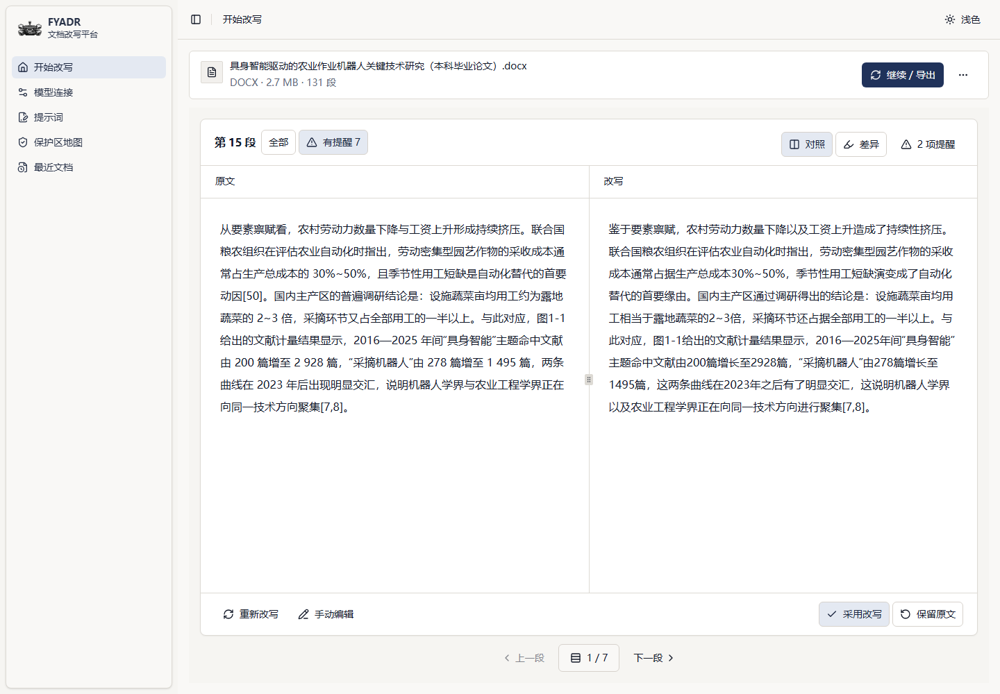
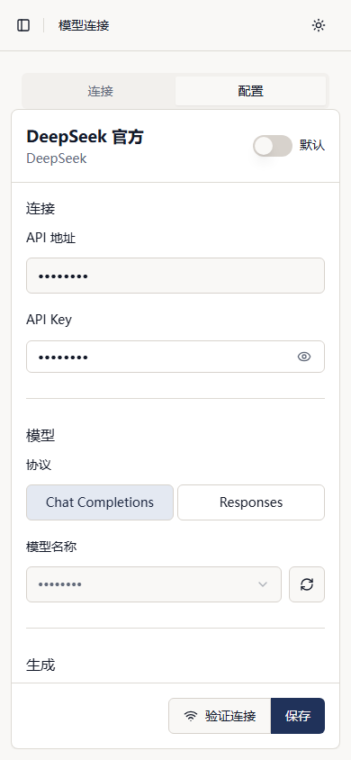

# 界面截图

以下截图来自一篇完整 DOCX 的本地改写结果。论文内容保持原样展示；模型连接、密钥、模型名称和提示词正文已遮挡。

## 改写与审阅

| 逐段对照 | 差异标记 |
|---|---|
|  |  |

| 手动编辑 | 仅看有提醒段落 |
|---|---|
|  |  |

## 正文范围

| 范围确认 | 保护区地图 |
|---|---|
|  |  |

## 继续改写与导出

| 模型、轮次与每轮提示词 | 分块、并发与保护词 |
|---|---|
|  |  |

| 导出前确认 | 最近文档 |
|---|---|
|  |  |

## 模型与提示词

| OpenAI 兼容连接 | DeepSeek 官方连接 |
|---|---|
|  |  |

## 响应式布局

| 平板 | 手机 |
|---|---|
|  |  |

